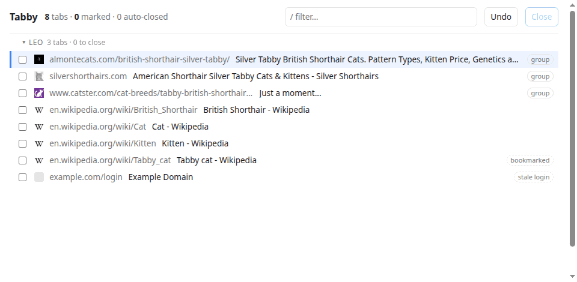
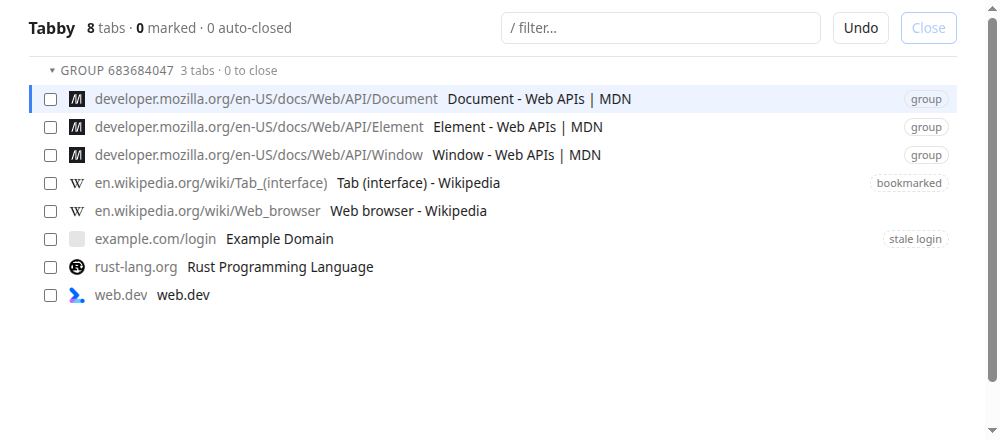
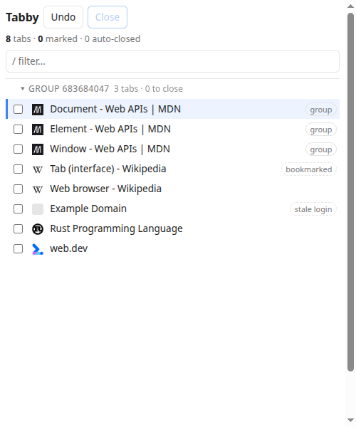
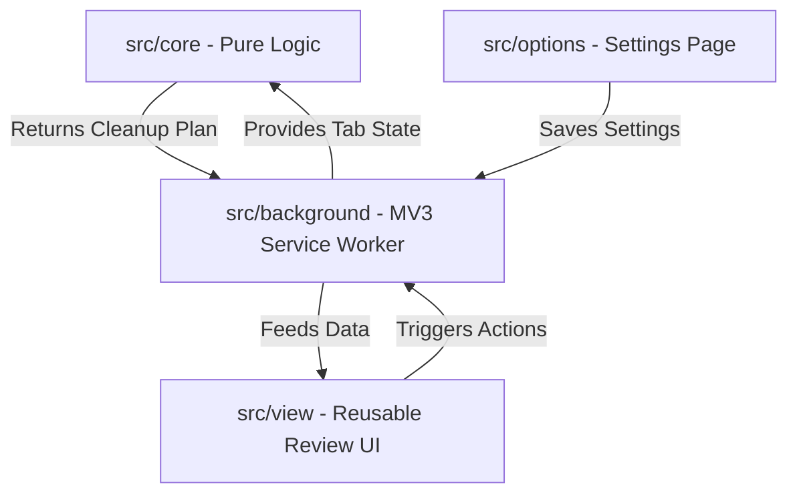

# Tabby

A fast, keyboard-driven Chrome extension for consolidating, sorting, and pruning your tabs. 

Tabby helps you regain control of your browser. With a single shortcut (`Ctrl+Shift+K` or `Cmd+Shift+K`), it gathers all your open tabs across all normal windows, removes exact duplicates and blank-tab clutter, sorts them by URL category (host, path, query), and opens a sleek, keyboard-driven review panel to let you prune whatever remains—complete with full session-aware undo.

Tabby is fully private, local-first, and telemetry-free.

## Screenshots

A cleanup in the keyboard-driven review — collapse a group with `z`, filter with `/`, mark tabs with `x`, close with `Ctrl+Enter`, and undo with `u`:



The full-page review surface — tabs consolidated, de-duplicated, and sorted, with an intact tab group and quiet advisory badges (`bookmarked`, `stale login`). The grouped tabs are research on the maintainer's cat, Leo, a silver tabby British shorthair:



The same review UI mounted in Chrome's native side panel, for pruning without leaving the page you're on:



---

## Key Features

### The Cleanup Pipeline
Tabby's pipeline is divided into three distinct automated stages before presenting the review:
1. **Consolidation:** Gathers tabs from all normal windows into the currently focused window, moving tab groups as intact units.
2. **Deduplication:** Merges identical pages (with customizable query parameter stripping and path normalizations) to auto-close exact duplicates while protecting your active, pinned, or audible tabs.
3. **Sorting:** Organizes remaining tabs lexicographically (Host → Path → Query) to put similar topics together, while maintaining tab group contiguity and protecting pinned tabs at the front.

### Keyboard-Driven Review
No mouse required. Tabby provides an extremely fast, vim-inspired keymap to review and prune your tabs:
- `j` / `k` — Move the cursor down / up
- `g` / `G` — Jump to the top / bottom of the list
- `x` / `Space` — Mark / unmark the selected tab for closing
- `V` (Visual Mode) — Select a range of tabs to bulk-mark with `x`
- `a` / `A` — Mark all / clear all marks in the current view
- `/` — Filter tabs by title or URL instantly (press `Esc` to clear)
- `Enter` — Jump directly to the selected tab, focusing its window
- `⌘+Enter` / `Ctrl+Enter` — Commit and close all marked tabs
- `u` — Undo the last commit, restoring closed tabs with full browser history
- `z` — Collapse / expand the tab group under the cursor
- `?` — Toggle the keyboard shortcut help cheatsheet
- `Esc` — Dismiss overlays, visual mode, or active filters

### Dual Review Surfaces
Tabby's entire interface is built host-agnostically, allowing you to choose how you want to review your tabs from the Options page:
* **Full Page (Default):** Opens in a dedicated full-browser tab (`review.html`) for wide, clear, and comprehensive list management.
* **Side Panel:** Mounts the exact same UI in Chrome's native side panel (`sidepanel.html`) for a lightweight, side-by-side pruning experience that won't take you away from your current web page. *Requires optional `sidePanel` permission requested on opt-in.*

### Quiet Close Suggestions
Tabby highlights tabs that are excellent candidates for closure using quiet, dashed hint badges (e.g., duplicated pages, empty/blank tabs, or matching specific staled-state signals). Clicking a badge marks that tab for closing on commit, keeping decisions explicitly in your control.

### Robust Group & Pinned Protection
* **Tab Groups:** Keeps your existing tab groups intact. If grouped tabs are moved during consolidation, they move as a whole unit, preventing group dissolution.
* **Audible & Pinned:** Pinned tabs and tabs playing audio are never auto-closed or moved unless explicitly requested or configured in options.
* **Stranded Auth Warning:** Highlights pages that may have expired sessions or stranded authentication sequences.

### Local Records Log & Navigation Trace
Tabby includes a local, telemetry-free Records surface. It tracks a log of your recommendations and close history, and features an opt-in **navigation trace mode** to help you inspect how you arrived at your open tabs and audit your tab patterns over time.

### Deep Configuration Options
Fine-tune Tabby's core behavior via the Options page:
- **Normalization:** Configure trailing-slash stripping, WWW matching, and exact query parameter blocking.
- **Custom Tracking Parameters:** Edit the blocklist of tracking query parameters (e.g., `utm_*`, `gclid`).
- **Keep Policies:** Set explicit rules for duplicate resolution (e.g., keep oldest, keep newest, keep active).
- **Surface Preference:** Switch between Full Page or Side Panel review formats.

---

## Installation

### Load Unpacked (From Source)

1. Clone this repository to your local machine.
2. Install dependencies:
   ```bash
   pnpm install
   ```
3. Build the extension for production:
   ```bash
   pnpm build
   ```
   This compiles TypeScript, bundles assets, and generates the loadable extension directory under `dist/`.
4. Open Google Chrome and navigate to `chrome://extensions`.
5. Enable **Developer mode** using the toggle in the top-right corner.
6. Click **Load unpacked** in the top-left corner.
7. Select the `dist/` directory from this project.
8. Click the Tabby extension icon or press `Ctrl+Shift+K` (or `Cmd+Shift+K`) to execute your first cleanup!

---

## Architecture

Tabby is built around a clean, layered architecture designed for strict testability and robust execution:



- **`src/core/` (Pure Logic):** Contains no references to `chrome.*` APIs. It models URL normalization, deduplication, lexicographical sorting, and plan building. It is 100% unit-tested in Vitest without requiring a browser.
- **`src/background/` (MV3 Orchestration):** Runs as an ephemeral service worker. It captures browser window/tab snapshots, handles global shortcuts and commands, translates declarative cleanup plans into sequential `chrome.tabs`/`chrome.tabGroups` calls, and buffers closed tabs for undo.
- **`src/view/` (Host-Agnostic UI):** A reusable Preact component suite that relies entirely on an abstract `ReviewTransport` interface. This allows the exact same UI to render in `src/review/` (Full Page) or `src/sidepanel/` (Side Panel) with zero view-logic forks.
- **`src/shared/` (Common Layer):** Standard types, default tracking parameter blocks, and storage schemas shared across all components.

---

## Development

```bash
pnpm dev        # Starts Vite dev server with Hot Module Replacement (CRXJS)
pnpm build      # Compiles and builds production assets to dist/
pnpm test       # Runs the Vitest test suite (184 unit tests)
pnpm typecheck  # Runs TypeScript compiler diagnostics
pnpm lint       # Enforces ESLint and Prettier standards
pnpm format     # Re-formats code files with Prettier
```

*Note: When running tests, always use `pnpm test` (or `vitest run`). Avoid `pnpm test run`, as Vitest interprets "run" as a search filter and will run zero tests.*

For the full design rationale see [`DESIGN.md`](./DESIGN.md), and for the phased
execution ledger see [`PLAN.md`](./PLAN.md).

---

## License

This project is licensed under the [MIT License](LICENSE).
